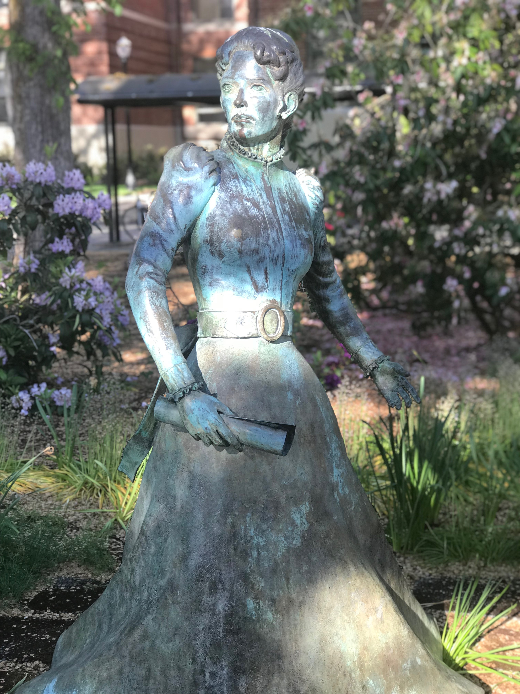

# Lab 6: Structure from Motion and Potree Visualization

> Spring 2018 | Geography 4/572 | Geovisualization: Geovisual Analytics
>
> **By**: Jared Ritchey | **Location**: Wilkinson 210 | **Time**: T 1800 - 1950
>
> **Assigned**: 05/22/2018 | **Due**: 05/29/2018 @ 11:59 pm | **Extra Credit Points** = 25

### Introduction

For this lab, we will explore how to work with Agisoft Photoscan in order to use Structure from Motion (SfM) to create a 3-D model from a series of still photos. As introduced in today's lecture, SfM identifies identical features that appear in multiple photos. Measuring how for the object has moved from one photo to the next, the software is able to identify how far the object is from the camera distance. This distance is used to generate depth and therefore, a 3-D model. This technology can be used to generate high resolution aerial maps, or very high detail models of a specific object. For this lab, we will be creating a 3-D model of the Quest statue that is in front of Strand Hall.

Once we generate the 3-D model (Point Cloud) in Photoscan, we will then convert our model to create a website which will enable us to view and interact with our model. This platform, known as Potree, reformates the data and generates a series of output files. These output files, if small enough in size, can be hosted and viewed through GitHub. Obviously, the more complicated the model, the larger the file size will be. 

### Photo Processing with Photoscan

The series of images needed to generate the 3-D model of the statue have already been gathered and are posted in the folder link below: https://drive.google.com/open?id=18jXLaFHFg0y2aqSsJ61Q0QOYaV_1nqdX

Please download these images and place them in a folder of your choice. Next, you will need to download Agisoft Photoscan to your computer. If you do not wish to do so or are unable, please let us know. The link to the download page is: http://www.agisoft.com/downloads/installer/

You will want to install the 64 bit for either Windows or Mac. After installing, please open the program. You will be greeted with a message letting you know that you do not have a license for the software. This is fine, as we will only need to use the demo mode of the software.

 

Demo mode will still allow you to explore how Photoscan works. It will allow you to do all of the processing steps. However, you will not be able to save or export any of the files that you generate. For that reason, the point cloud file (.las) needed to make your Potree page has already been generated and also in the shared lab folder that you downloaded from the Google Drive.

Once Photoscan is open, begin by first going to workflow and selecting 'Add Photos'. Navigate to the Google Drive folder that you have downloaded and select all of the photos. Once all the photos have been selected, click Open. This will import all of the photos into photo workspace window. Once in the window, we will run the next option in the workflow menu, 'Align Photos'. The following window will give you the option to adjust the settings of the operation. 

Keep in mind that the higher you place the settings, the more of a load it will be on your computer. With something as big as 600 photos on high settings, even with a very powerful computer, could take 10 to 12 hours to process. For this exercise, I recommend running the steps either in 'low' or 'lowest' settings. Once the processing is complete, you will have generated a sparse point cloud. 

It is 3-dimensional, but it just doesn't have a high density. These points (tie points) will be used for the generation of the dense point cloud. To generate the dense point cloud, go back to the 'Workflow' menu and select 'Dense Point Cloud'. The resulting output will be much higher in density and should provide a high level of detail of the modelled surface. If you choose to do so, you can manually delete points to clean the model up. Once you have the model the model the way you want it, it is ready for export to convert into your Potree page. Unfortunately, if you do not have the license, you can't export the file. Luckily, the file has already been provided to you in the folder that you previously downloaded with the rest of the images.

If your goal was to generate a orthophoto or perhaps a tiled model, you would just continue through the workflow until you received your desired output. In this case, if you were to generate a tiled model of this statue, it would look something like the image below.

##### For this step, please take a screenshot of your point cloud and include in the markdown file that you will be submitting.

### Potree File Conversion

For this portion step, we will take the LAS file you have been provide or the one you have generated on your own, and we will run some code that will reformate it for us to use in Potree. If you have not done so yet, please download the supplied LAS file from the folder that is linked above. 

Next, please go to the [Potree Conversion 1.6 release](https://github.com/potree/PotreeConverter/releases/tag/1.6) and download the zip file to your station. Once the file has been downloaded, place them in a folder that will solely be dedicated to this Potree page. Extract the files in this location. The output folder will look like the image below.

 

Next, for simplicity, place the LAS file in this folder. Using the command prompt, run the following code from the same folder you have just created:

`PotreeConverter.exe G:\input.las -o G:\output -p index --overwrite --output-format LAS`

> Note that the first file will be your input LAS and the second file will be your output location. Please change these as needed for your personal needs. The rest of the code does not need to be adjusted. The image below is an example of what it may look like.

Once the script has completed its process, your folder should look like the image below:

If you run the index.html file, you should see the resulting Potree Page.

Now that we have generated our files, lets get things ready to send to GitHub. Remove the extra files from your folder so that the only remaining files are those that are needed are for rendering on GitHub. 

 

##### Make sure to include a ReadMe file as well that describes your page and contains a screenshot of your point cloud. 

Now we are ready to upload our files to GitHub. Make a new repository for this project. Unfortunately, there are to many files to just drag in drop the files into the window provided on GitHub's site. To overcome this, we recommend that you use the VCS capabilities of Webstorm to upload it. By creating a project in Webstorm of your repository, you should be able to commit the changes through the VCS and upload all of the files at once. Once completed, navigate to the GitHub pages under the repository settings and ensure the master branch is selected. Include the given URL in your README file.

### Deliverables

Please follow the directions that are given on the class repository. The directions for this lab can be found by clicking [here](http://geoviz.ceoas.oregonstate.edu/geog4572/labs/lab06/). If you have any questions, please don't hesitate to ask. 

